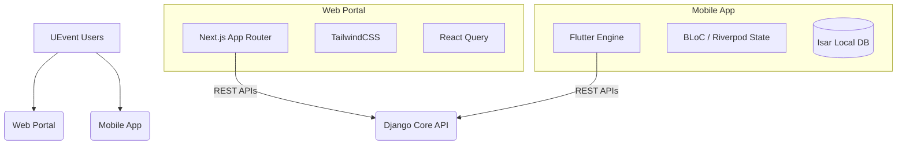

<div align="center">
  

  # UEvent Frontend Repository
  
  **Next-Gen Omnichannel Client Ecosystem**

  [](https://nextjs.org/)
  [](https://reactjs.org/)
  [](https://flutter.dev/)
  [](https://www.typescriptlang.org/)
  [](https://opensource.org/licenses/MIT)
  [](http://makeapullrequest.com)

  *Engineered for **Phân hiệu Trường Đại học Giao thông Vận tải tại Thành phố Hồ Chí Minh (UTC2)***
</div>

<p align=center>
  <a href=./README.vi.md>Đọc bản Tiếng Việt</a>
</p>

---

## 📖 Table of Contents

- [About The Project](#-about-the-project)
- [Related Repositories](#-related-repositories)
- [Repository Architecture](#-repository-architecture)
- [1. Web Admin Portal (Next.js)](#1-web-admin-portal-nextjs)
- [2. Mobile Attendee App (Flutter)](#2-mobile-attendee-app-flutter)
- [Project Structure](#-project-structure)
- [Runtime Versions & Dependencies](#-runtime-versions--dependencies)
- [Installation & Getting Started](#-installation--getting-started)
- [Firebase Configuration](#-firebase-configuration)
- [Test Accounts & Operational Notes](#-test-accounts--operational-notes)
- [Engineering Standards & QA](#-engineering-standards--qa)
- [Contributing](#-contributing)
- [License](#-license)

---

## 🚀 About The Project

The **UEvent Frontend Repository** houses the client-facing applications for the UEvent ecosystem. By separating concerns between the administrative backend portal and the on-the-ground mobile application, this repository ensures the best possible UX/UI for diverse user roles.

It serves two distinct target audiences:
1. **Event Administrators & Organizers**: Utilizing a sprawling, SEO-optimized web dashboard to create complex event forms, manage roles, and review analytics.
2. **Attendees & On-Site Operators**: Relying on a blazing-fast, offline-capable mobile application to receive push notifications, generate entry QR codes, and quickly scan incoming attendees at the physical event gates.

---

## 🔗 Related Repositories

UEvent is split into dedicated frontend and backend repositories so each layer can be configured, deployed, and reviewed independently.

| Repository | Purpose |
|------------|---------|
| **Frontend** | This repository: Next.js Admin Portal and Flutter Mobile App. |
| **Backend** | [UEvent-Backend](https://github.com/TriNguyenThanh/UEvent-Backend): Django REST API, PostgreSQL domain model, authentication, FCM delivery, and system administration endpoints. |

When running the full system locally, start the backend first, then point `web/.env.local` and `mobile/lib/core/config/env_config.dart` to the backend API URL.

---

## 🏛 Repository Architecture

Rather than maintaining separate Git histories, the UEvent frontend codebase is structured cleanly to house both web and mobile logic.



---

## 🌐 1. Web Admin Portal (Next.js)

The web client is an expansive management interface.

### Key Features
- **Intuitive Form Builder**: Drag-and-drop UI to construct complex event registration fields, generating schemas sent directly to the Backend's JSONB handlers.
- **Deep Analytics Dashboards**: Visual charts tracking ticket sales, check-in rates, and real-time room capacity.
- **User Governance**: Interfaces to assign Co-hosts, Staff, and Check-in Operators dynamically.

### Tech Stack
- **Framework**: Next.js 16.2.1 (App Router) + React 19.2.4
- **Language**: TypeScript
- **Styling**: TailwindCSS for utility-first, responsive layouts.
- **Data Fetching**: React Query (TanStack) for caching and optimistic UI updates.

---

## 📱 2. Mobile Attendee App (Flutter)

The mobile client is optimized for speed, reliability under poor network conditions, and rapid execution.

### Key Features
- **Offline-First Resilience**: Uses `Isar` to cache ticket data locally, allowing attendees to view their QR code even inside concrete halls with zero signal.
- **Cryptographic QR Wallet**: Generates a 15-second rotating digital signature. It guarantees that screenshots sent to friends cannot be used for entry.
- **Operator Scanner Module**: Staff members access a highly optimized barcode scanning view capable of parsing and validating hundreds of attendees per minute.

### Tech Stack
- **Framework**: Flutter 3.41.2 stable + Dart 3.11.0
- **Architecture Standard**: Clean Architecture (Domain, Data, Presentation layers strictly separated).
- **State Management**: BLoC / Cubit for complex business logic, Riverpod for dependency injection.
- **Network**: `Dio` with custom interceptors for JWT token refresh.

---

## 📂 Project Structure

```bash
UEvent-Frontend/
├── web/                      # Next.js Web Directory
│   ├── src/
│   │   ├── app/              # App Router Pages
│   │   ├── components/       # Reusable React components
│   │   ├── lib/              # Axios instances, utilities
│   │   └── styles/           # Global Tailwind directives
│   ├── package.json
│   └── tailwind.config.ts
│
├── mobile/                   # Flutter Mobile Directory
│   ├── lib/
│   │   ├── core/             # Routing, Theme, Errors
│   │   ├── features/         # Feature-first structure (events, tickets)
│   │   │   └── event/
│   │   │       ├── data/     # Models, Repositories, Data Sources
│   │   │       ├── domain/   # Entities, Use Cases
│   │   │       └── present/  # UI, Widgets, BLoCs
│   │   └── main.dart         # Entry point
│   └── pubspec.yaml
│
└── stitch_assets/            # Shared branding assets, icons, fonts
```

---

## 🧰 Runtime Versions & Dependencies

| Area | Required Version / Package Set |
|------|--------------------------------|
| **Node.js** | Node.js 20.x recommended (`20.19.5` was used during local verification). |
| **Package Manager** | npm 10.x recommended (`10.8.2` was used during local verification). |
| **Web Runtime** | Next.js `16.2.1`, React `19.2.4`, TypeScript `^5`, TailwindCSS `^4`, ESLint `^9`. |
| **Flutter SDK** | Flutter `3.41.2` on the `stable` channel. |
| **Dart SDK** | Dart `3.11.0` via Flutter. |
| **Android Tooling** | Android SDK / Android Studio with Java 17 compatibility. |
| **iOS Tooling** | Xcode on macOS if the iOS target is restored and built. |

Key Web packages are listed in `web/package.json`: `next`, `react`, `react-dom`, `lucide-react`, `sonner`, `@radix-ui/react-alert-dialog`, `clsx`, and `tailwind-merge`.

Key Mobile packages are listed in `mobile/pubspec.yaml`: `dio`, `flutter_riverpod`, `firebase_core`, `firebase_messaging`, `flutter_local_notifications`, `google_sign_in`, `flutter_appauth`, `flutter_secure_storage`, `local_auth`, `passkeys`, `qr_flutter`, `mobile_scanner`, `sqflite`, `cached_network_image`, `image_picker`, `permission_handler`, `url_launcher`, `share_plus`, `excel`, and `file_saver`.

---

## 💻 Installation & Getting Started

### 0. Download Android APK

If you only need to install and test the Android mobile application without building from source, download the latest APK here:

```text
https://uevent.u-code.dev/download
```

For development, continue with the Web and Mobile setup steps below.

### 1. Web Application

```bash
cd web

# Install Node dependencies
npm install  # or yarn install

# Setup Environment
cp .env.example .env.local
# Update .env.local with NEXT_PUBLIC_API_BASE_URL=http://localhost:8000/api/v1

# Run development server
npm run dev
```

Visit `http://localhost:3000` to access the portal.

### 2. Mobile Application

```bash
cd mobile

# Fetch Flutter packages
flutter pub get

# Generate necessary boilerplate (if using Freezed/Injectable)
flutter pub run build_runner build --delete-conflicting-outputs

# Configure API URL in your local .env or config file
# mobile/lib/core/config/env_config.dart -> EnvConfig.baseUrl
# Android emulator: http://10.0.2.2:8000/api/v1
# Physical device: http://<YOUR_BACKEND_LAN_IP>:8000/api/v1

# Run on an emulator or connected physical device
flutter run
```

---

## 🔥 Firebase Configuration

The mobile application uses Firebase for Firebase Cloud Messaging (FCM) and Google Sign-In integration.

Required Firebase files:

| Platform | Required File | Current Status |
|----------|---------------|----------------|
| **Android** | `mobile/android/app/google-services.json` | Present in the working project. A sample file also exists at `mobile/android/app/google-services.example.json`. |
| **iOS** | `mobile/ios/Runner/GoogleService-Info.plist` | Required only when building iOS. The `mobile/ios/` directory is currently ignored in this repository, so download it from Firebase Console before building iOS. |
| **FlutterFire** | `mobile/lib/firebase_options.dart` | Present in the working project and generated by FlutterFire CLI. |

### Configuration File Locations

| File | Place / Edit Here | Purpose |
|------|-------------------|---------|
| Web environment file | `web/.env.local` | Local Next.js runtime variables such as `NEXT_PUBLIC_API_BASE_URL`. Create it from `web/.env.example`. |
| Web environment template | `web/.env.example` | Safe example for web environment variables. Commit this file, not `.env.local`. |
| Mobile API/runtime config | `mobile/lib/core/config/env_config.dart` | Mobile API base URL, Keycloak/OIDC constants, and Google server client ID. |
| Android Firebase config | `mobile/android/app/google-services.json` | Android Firebase client configuration downloaded from Firebase Console. |
| Android Firebase sample | `mobile/android/app/google-services.example.json` | Safe placeholder/sample for Android Firebase config. |
| iOS Firebase config | `mobile/ios/Runner/GoogleService-Info.plist` | iOS Firebase client configuration downloaded from Firebase Console. Required only when iOS target is restored and built. |
| FlutterFire generated options | `mobile/lib/firebase_options.dart` | Generated by `flutterfire configure`; consumed by `Firebase.initializeApp`. |
| Android application ID | `mobile/android/app/build.gradle.kts` | `applicationId` must match the Android app package registered in Firebase. |

### Create Firebase Client Configuration Files

Create the required client files from Firebase Console when setting up a new Firebase project, changing package names, or rotating configuration:

1. Open Firebase Console and select or create the UEvent Firebase project.
2. Go to **Project settings** > **General** > **Your apps**.
3. For Android, click **Add app** or open the existing Android app.
4. Set the Android package name to the same value as `applicationId` in `mobile/android/app/build.gradle.kts`.
5. Add the required SHA fingerprints as described below, then download `google-services.json`.
6. Place the downloaded file at `mobile/android/app/google-services.json`.
7. For iOS, click **Add app** or open the existing iOS app.
8. Set the iOS bundle ID to the value used by the Xcode `Runner` target.
9. Download `GoogleService-Info.plist` and place it at `mobile/ios/Runner/GoogleService-Info.plist`.
10. Open Xcode and confirm `GoogleService-Info.plist` is included in the `Runner` target membership.
11. Run FlutterFire CLI to regenerate `mobile/lib/firebase_options.dart` so Flutter code matches the Firebase project.

To regenerate Firebase configuration:

```bash
npm install -g firebase-tools
dart pub global activate flutterfire_cli
firebase login

cd mobile
flutterfire configure --project uevent-production --platforms android,ios,web,windows --out lib/firebase_options.dart
```

### Android SHA-1 / SHA-256 Fingerprints

Google Sign-In and Firebase Authentication require Android app fingerprints. Add both **SHA-1** and **SHA-256** for every Android build identity you use, usually debug and release.

Fast path for the default Android debug keystore:

```bash
# Windows PowerShell
keytool -list -v -keystore '$env:USERPROFILE\.android\debug.keystore' -alias androiddebugkey -storepass android -keypass android

# macOS / Linux
keytool -list -v -keystore ~/.android/debug.keystore -alias androiddebugkey -storepass android -keypass android
```

If `keytool` is not available in `PATH` on Windows, use the JDK bundled with Android Studio:

```powershell
& 'C:\Program Files\Android\Android Studio\jbr\bin\keytool.exe' -list -v -keystore '$env:USERPROFILE\.android\debug.keystore' -alias androiddebugkey -storepass android -keypass android
```

Alternatively, generate debug fingerprints with Gradle:

```bash
cd mobile/android

# Windows
.\gradlew.bat signingReport

# macOS / Linux
./gradlew signingReport
```

In the output, copy both `SHA1` and `SHA256` / `SHA-256` values. The `debug.keystore` values are only valid for debug builds signed on that machine.

If you have a release keystore, generate release fingerprints with `keytool`:

```bash
keytool -list -v -keystore <path-to-release-keystore> -alias <release-key-alias>
```

Add the fingerprints and download a fresh Android config file:

1. Open Firebase Console and select the UEvent Firebase project.
2. Go to **Project settings** > **General** > **Your apps**.
3. Select the Android app whose package name matches `applicationId` in `mobile/android/app/build.gradle.kts`.
4. In **SHA certificate fingerprints**, click **Add fingerprint**.
5. Add the debug `SHA-1`, debug `SHA-256`, and release fingerprints if release builds are used.
6. Click **Save**, then click **Download google-services.json**.
7. Replace `mobile/android/app/google-services.json` with the downloaded file.
8. Run `flutter clean`, then `flutter pub get`, and rebuild the app.

Important Firebase notes:

- Android Firebase package name must match `applicationId` in `mobile/android/app/build.gradle.kts` (`com.example.frontend` at the time of writing).
- If `applicationId` changes, download a matching `google-services.json` again.
- `EnvConfig.googleServerClientId` in `mobile/lib/core/config/env_config.dart` must match a valid Google OAuth Web Client ID.
- Backend must include the same Google OAuth client ID in `GOOGLE_OAUTH_CLIENT_IDS` for Google token verification.

---

## 🧪 Test Accounts & Operational Notes

No official test account credentials are stored in the frontend repository. Authentication depends on the backend, Keycloak / Google OAuth, and seeded backend users. Create a backend superuser or use the test credentials provided by the deployment owner.

Operational requirements:

- Run the backend before using live login, event, ticket, notification, or admin workflows.
- The Web app reads its API endpoint from `NEXT_PUBLIC_API_BASE_URL` in `web/.env.local`.
- The Mobile app currently reads its API endpoint from `EnvConfig.baseUrl` in `mobile/lib/core/config/env_config.dart`.
- When using a physical phone, `localhost` points to the phone itself. Use the backend machine's LAN IP instead.
- Keep Firebase service accounts, release keystores, private tokens, and production secrets out of this frontend repository.

---

## ⚙️ Engineering Standards & QA

We hold our client applications to strict enterprise standards:
- **Linting Guidelines**: The Next.js project enforces strict `eslint` rules. The Flutter app uses `flutter_lints` and `dart format`.
- **Clean Architecture Enforcement**: In the mobile directory, UI widgets are forbidden from importing data sources or HTTP clients directly; everything must pass through the Domain layer's Use Cases.
- **Component Reusability**: The Web platform relies on a strict internal Design System mapped out in `components/ui/`.

---

## 🤝 Contributing

1. Fork the Repository.
2. Create a Feature Branch (`git checkout -b feature/NewUI`).
3. If working on Flutter, ensure `flutter test` and `flutter analyze` pass.
4. If working on Web, ensure `npm run build` succeeds without linting errors.
5. Commit your Changes (`git commit -m 'Implement NewUI'`).
6. Push to the Branch (`git push origin feature/NewUI`).
7. Open a Pull Request.

---

## 📜 License

Distributed under the MIT License. See `LICENSE` for more information.
