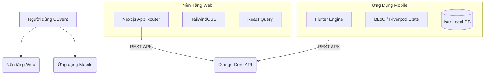

<div align="center">
  

  # UEvent Frontend Repository (Tiếng Việt)
  
  **Hệ Sinh Thái Giao Diện Sự Kiện Đa Nền Tảng Thế Hệ Mới**

  [](https://nextjs.org/)
  [](https://reactjs.org/)
  [](https://flutter.dev/)
  [](https://www.typescriptlang.org/)
  [](https://opensource.org/licenses/MIT)
  [](http://makeapullrequest.com)

  *Được thiết kế độc quyền cho **Phân hiệu Trường Đại học Giao thông Vận tải tại TP.HCM (UTC2)***
</div>

---

## 📖 Mục Lục

- [Giới Thiệu Dự Án](#-giới-thiệu-dự-án)
- [Repository Liên Quan](#-repository-liên-quan)
- [Kiến Trúc Repository](#-kiến-trúc-repository)
- [1. Cổng Thông Tin Web (Next.js)](#1-cổng-thông-tin-web-nextjs)
- [2. Ứng Dụng Mobile (Flutter)](#2-ứng-dụng-mobile-flutter)
- [Cấu Trúc Thư Mục](#-cấu-trúc-thư-mục)
- [Phiên Bản Môi Trường & Dependency](#-phiên-bản-môi-trường--dependency)
- [Hướng Dẫn Cài Đặt](#-hướng-dẫn-cài-đặt)
- [Cấu Hình Firebase](#-cấu-hình-firebase)
- [Tài Khoản Test & Lưu Ý Vận Hành](#-tài-khoản-test--lưu-ý-vận-hành)
- [Tiêu Chuẩn Kỹ Thuật & Đảm Bảo Chất Lượng](#-tiêu-chuẩn-kỹ-thuật--đảm-bảo-chất-lượng)
- [Hướng Dẫn Đóng Góp](#-hướng-dẫn-đóng-góp)
- [Bản Quyền](#-bản-quyền)

---

## 🚀 Giới Thiệu Dự Án

**UEvent Frontend** là repository tập trung mã nguồn của toàn bộ các nền tảng giao diện phía người dùng (Client-facing). Bằng cách tách biệt ứng dụng Web quản trị và ứng dụng Mobile di động, kho lưu trữ này mang đến trải nghiệm UI/UX tốt nhất cho từng đối tượng cụ thể.

Hệ thống phục vụ 2 nhóm người dùng chính:
1. **Ban Quản Trị & Ban Tổ Chức (Web)**: Sử dụng một Dashboard web khổng lồ, chuẩn SEO để xây dựng các biểu mẫu đăng ký, quản lý ban bệ nhân sự và theo dõi báo cáo phân tích.
2. **Sinh Viên Tham Dự & Nhân Viên Quét Vé (Mobile)**: Dựa vào một ứng dụng di động tốc độ siêu cao, có khả năng hoạt động ngay cả khi rớt mạng, để nhận thông báo, xuất mã QR vé và quét mã cho sinh viên ngay tại cổng kiểm soát.

---

## 🔗 Repository Liên Quan

UEvent được tách thành repository frontend và backend riêng để từng lớp có thể cấu hình, triển khai và review độc lập.

| Repository | Vai trò |
|------------|---------|
| **Frontend** | Repository hiện tại: Next.js Admin Portal và Flutter Mobile App. |
| **Backend** | [UEvent-Backend](https://github.com/TriNguyenThanh/UEvent-Backend): Django REST API, mô hình dữ liệu PostgreSQL, xác thực, gửi FCM và các endpoint quản trị hệ thống. |

Khi chạy toàn bộ hệ thống local, hãy chạy backend trước, sau đó trỏ `web/.env.local` và `mobile/lib/core/config/env_config.dart` về URL API của backend.

---

## 🏛 Kiến Trúc Repository

Mã nguồn được tổ chức rành mạch, phân tách rõ ràng giữa Web và Mobile trong cùng một không gian thư mục.



---

## 🌐 1. Cổng Thông Tin Web (Next.js)

Giao diện Web là bảng điều khiển mạnh mẽ dành cho cấp quản lý.

### Tính Năng Nổi Bật
- **Trình Tạo Form Trực Quan (Form Builder)**: Giao diện kéo-thả giúp ban tổ chức lắp ghép các trường dữ liệu tùy biến, tự động biên dịch thành schema JSONB để gửi lên Backend.
- **Dashboard Phân Tích Chuyên Sâu**: Biểu đồ trực quan theo dõi lượng vé phát hành, tỷ lệ người check-in thực tế và sức chứa phòng học.
- **Quản Trị Người Dùng**: Giao diện điều phối và gán quyền (Đồng tổ chức, Nhân viên, Ban kiểm duyệt) cực kỳ nhanh chóng.

### Công Nghệ Sử Dụng
- **Khung Ứng Dụng**: Next.js 16.2.1 (App Router) + React 19.2.4
- **Ngôn Ngữ**: TypeScript
- **Giao Diện**: TailwindCSS (Responsive layout)
- **Truy Xuất Dữ Liệu**: React Query (TanStack) giúp cache dữ liệu và phản hồi UI ngay lập tức (Optimistic updates).

---

## 📱 2. Ứng Dụng Mobile (Flutter)

Ứng dụng di động được tối ưu hóa về tốc độ, hoạt động ổn định trong các hội trường bê tông kém sóng.

### Tính Năng Nổi Bật
- **Sức Chịu Đựng Mất Mạng (Offline-First)**: Sử dụng CSDL `Isar` siêu tốc lưu trữ vé về máy. Sinh viên có thể mở vé QR kể cả khi điện thoại hoàn toàn mất kết nối 4G/Wifi.
- **Ví QR Mã Hóa Chữ Ký Số**: Tự động sinh mã QR xoay vòng mỗi 15 giây. Hệ thống triệt tiêu hoàn toàn khả năng qua cửa bằng việc gửi ảnh chụp màn hình vé cho bạn bè.
- **Module Máy Quét Cấp Độ Nhàn Rỗi (Operator Scanner)**: Nhân viên cổng sử dụng module quét mã vạch chuyên dụng cực kỳ nhẹ, quét liên tục và xử lý hàng trăm sinh viên một phút không giật lag.

### Công Nghệ Sử Dụng
- **Khung Ứng Dụng**: Flutter 3.41.2 stable + Dart 3.11.0
- **Kiến Trúc Tiêu Chuẩn**: Clean Architecture (Chia tách nghiêm ngặt 3 lớp: Domain, Data, Presentation).
- **Quản Lý Trạng Thái**: BLoC / Cubit cho logic phức tạp, Riverpod để tiêm phụ thuộc (Dependency Injection).
- **Kết Nối Mạng**: `Dio` với các bộ đánh chặn (interceptors) tự động làm mới JWT Token.

---

## 📂 Cấu Trúc Thư Mục

```bash
UEvent-Frontend/
├── web/                      # Thư mục mã nguồn Next.js Web
│   ├── src/
│   │   ├── app/              # Router App của Next.js
│   │   ├── components/       # Các component UI tái sử dụng
│   │   ├── lib/              # Tiện ích, cấu hình Axios
│   │   └── styles/           # CSS toàn cục & Tailwind config
│   ├── package.json
│   └── tailwind.config.ts
│
├── mobile/                   # Thư mục mã nguồn Flutter Mobile
│   ├── lib/
│   │   ├── core/             # Lỗi, Theme, Điều hướng
│   │   ├── features/         # Cấu trúc chia theo tính năng (Feature-first)
│   │   │   └── event/
│   │   │       ├── data/     # Gọi API, Local DB, Models
│   │   │       ├── domain/   # Luật nghiệp vụ, Use Cases
│   │   │       └── present/  # UI, Widgets, BLoC State
│   │   └── main.dart         # File khởi chạy
│   └── pubspec.yaml
│
└── stitch_assets/            # Hình ảnh, font, thiết kế dùng chung
```

---

## 🧰 Phiên Bản Môi Trường & Dependency

| Khu vực | Phiên bản / Gói cần có |
|---------|-------------------------|
| **Node.js** | Khuyến nghị Node.js 20.x (`20.19.5` là phiên bản đã kiểm tra local). |
| **Package Manager** | Khuyến nghị npm 10.x (`10.8.2` là phiên bản đã kiểm tra local). |
| **Web Runtime** | Next.js `16.2.1`, React `19.2.4`, TypeScript `^5`, TailwindCSS `^4`, ESLint `^9`. |
| **Flutter SDK** | Flutter `3.41.2` kênh `stable`. |
| **Dart SDK** | Dart `3.11.0` đi kèm Flutter. |
| **Android Tooling** | Android SDK / Android Studio, tương thích Java 17. |
| **iOS Tooling** | Xcode trên macOS nếu cần khôi phục và build target iOS. |

Các package Web chính nằm trong `web/package.json`: `next`, `react`, `react-dom`, `lucide-react`, `sonner`, `@radix-ui/react-alert-dialog`, `clsx`, `tailwind-merge`.

Các package Mobile chính nằm trong `mobile/pubspec.yaml`: `dio`, `flutter_riverpod`, `firebase_core`, `firebase_messaging`, `flutter_local_notifications`, `google_sign_in`, `flutter_appauth`, `flutter_secure_storage`, `local_auth`, `passkeys`, `qr_flutter`, `mobile_scanner`, `sqflite`, `cached_network_image`, `image_picker`, `permission_handler`, `url_launcher`, `share_plus`, `excel`, `file_saver`.

---

## 💻 Hướng Dẫn Cài Đặt & Khởi Chạy

### 0. Tải APK Android

Nếu chỉ cần cài và kiểm thử ứng dụng Android mà không build từ source, tải APK mới nhất tại:

```text
https://uevent.u-code.dev/download
```

Nếu cần phát triển tiếp, tiếp tục theo các bước cài đặt Web và Mobile bên dưới.

### 1. Nền Tảng Web (Next.js)

```bash
cd web

# Cài đặt thư viện Node
npm install  # hoặc yarn install

# Thiết lập Môi trường
cp .env.example .env.local
# Đổi biến NEXT_PUBLIC_API_BASE_URL=http://localhost:8000/api/v1 (trong file .env.local)

# Chạy server ở chế độ Development
npm run dev
```

Truy cập `http://localhost:3000` trên trình duyệt để kiểm tra.

### 2. Ứng Dụng Mobile (Flutter)

```bash
cd mobile

# Tải các gói thư viện Flutter
flutter pub get

# Tạo các file code sinh tự động (Nếu xài Freezed/Injectable)
flutter pub run build_runner build --delete-conflicting-outputs

# Cấu hình URL gọi API trong mobile/lib/core/config/env_config.dart
# Android emulator: http://10.0.2.2:8000/api/v1
# Thiết bị thật: http://<IP_LAN_MÁY_CHẠY_BACKEND>:8000/api/v1

# Khởi chạy trên máy ảo hoặc thiết bị thật cắm cáp
flutter run
```

---

## 🔥 Cấu Hình Firebase

Ứng dụng mobile sử dụng Firebase cho Firebase Cloud Messaging (FCM) và Google Sign-In.

Các file Firebase cần có:

| Nền tảng | File cần có | Trạng thái hiện tại |
|----------|-------------|---------------------|
| **Android** | `mobile/android/app/google-services.json` | Đã có trong project đang làm việc. File mẫu nằm tại `mobile/android/app/google-services.example.json`. |
| **iOS** | `mobile/ios/Runner/GoogleService-Info.plist` | Chỉ bắt buộc khi build iOS. Thư mục `mobile/ios/` hiện đang bị ignore, nên cần tải file này từ Firebase Console trước khi build iOS. |
| **FlutterFire** | `mobile/lib/firebase_options.dart` | Đã có trong project đang làm việc và được sinh bởi FlutterFire CLI. |

### Vị Trí Đặt File Cấu Hình

| File | Đặt / chỉnh tại | Mục đích |
|------|-----------------|----------|
| File môi trường Web | `web/.env.local` | Biến runtime local của Next.js như `NEXT_PUBLIC_API_BASE_URL`. Tạo từ `web/.env.example`. |
| File mẫu môi trường Web | `web/.env.example` | Mẫu an toàn cho biến môi trường Web. Commit file này, không commit `.env.local`. |
| Cấu hình runtime Mobile | `mobile/lib/core/config/env_config.dart` | API base URL của mobile, hằng số Keycloak/OIDC và Google server client ID. |
| Cấu hình Firebase Android | `mobile/android/app/google-services.json` | File cấu hình Firebase Android tải từ Firebase Console. |
| File mẫu Firebase Android | `mobile/android/app/google-services.example.json` | Placeholder/mẫu an toàn cho cấu hình Firebase Android. |
| Cấu hình Firebase iOS | `mobile/ios/Runner/GoogleService-Info.plist` | File cấu hình Firebase iOS tải từ Firebase Console. Chỉ bắt buộc khi khôi phục và build target iOS. |
| Cấu hình FlutterFire sinh tự động | `mobile/lib/firebase_options.dart` | Sinh bởi `flutterfire configure`; được dùng khi gọi `Firebase.initializeApp`. |
| Android application ID | `mobile/android/app/build.gradle.kts` | `applicationId` phải khớp package name của Android app đã đăng ký trên Firebase. |

### Tạo File Cấu Hình Firebase Client

Tạo các file client từ Firebase Console khi thiết lập Firebase project mới, đổi package name hoặc cần sinh lại cấu hình:

1. Mở Firebase Console và chọn hoặc tạo Firebase project của UEvent.
2. Vào **Project settings** > **General** > **Your apps**.
3. Với Android, bấm **Add app** hoặc mở Android app đã có.
4. Đặt Android package name trùng với `applicationId` trong `mobile/android/app/build.gradle.kts`.
5. Thêm các SHA fingerprint theo hướng dẫn bên dưới, sau đó tải `google-services.json`.
6. Đặt file vừa tải tại `mobile/android/app/google-services.json`.
7. Với iOS, bấm **Add app** hoặc mở iOS app đã có.
8. Đặt iOS bundle ID trùng với bundle ID của target Xcode `Runner`.
9. Tải `GoogleService-Info.plist` và đặt tại `mobile/ios/Runner/GoogleService-Info.plist`.
10. Mở Xcode và kiểm tra `GoogleService-Info.plist` đã được thêm vào target membership của `Runner`.
11. Chạy FlutterFire CLI để sinh lại `mobile/lib/firebase_options.dart`, bảo đảm code Flutter khớp Firebase project.

Sinh lại cấu hình Firebase khi đổi project hoặc đổi package name:

```bash
npm install -g firebase-tools
dart pub global activate flutterfire_cli
firebase login

cd mobile
flutterfire configure --project uevent-production --platforms android,ios,web,windows --out lib/firebase_options.dart
```

### SHA-1 / SHA-256 Cho Android

Google Sign-In và Firebase Authentication cần fingerprint của ứng dụng Android. Hãy thêm cả **SHA-1** và **SHA-256** cho từng identity build Android đang dùng, thường là debug và release.

Cách nhanh nhất với Android debug keystore mặc định:

```bash
# Windows PowerShell
keytool -list -v -keystore '$env:USERPROFILE\.android\debug.keystore' -alias androiddebugkey -storepass android -keypass android

# macOS / Linux
keytool -list -v -keystore ~/.android/debug.keystore -alias androiddebugkey -storepass android -keypass android
```

Nếu Windows chưa nhận lệnh `keytool`, dùng JDK đi kèm Android Studio:

```powershell
& 'C:\Program Files\Android\Android Studio\jbr\bin\keytool.exe' -list -v -keystore '$env:USERPROFILE\.android\debug.keystore' -alias androiddebugkey -storepass android -keypass android
```

Hoặc tạo fingerprint debug bằng Gradle:

```bash
cd mobile/android

# Windows
.\gradlew.bat signingReport

# macOS / Linux
./gradlew signingReport
```

Trong output, copy cả giá trị `SHA1` và `SHA256` / `SHA-256`. Giá trị từ `debug.keystore` chỉ áp dụng cho debug build được ký trên máy đó.

Nếu có release keystore, tạo fingerprint release bằng `keytool`:

```bash
keytool -list -v -keystore <duong-dan-release-keystore> -alias <release-key-alias>
```

Thêm fingerprint và tải lại file cấu hình Android:

1. Mở Firebase Console và chọn Firebase project của UEvent.
2. Vào **Project settings** > **General** > **Your apps**.
3. Chọn Android app có package name khớp `applicationId` trong `mobile/android/app/build.gradle.kts`.
4. Tại **SHA certificate fingerprints**, bấm **Add fingerprint**.
5. Thêm debug `SHA-1`, debug `SHA-256`, và fingerprint release nếu có build release.
6. Bấm **Save**, sau đó bấm **Download google-services.json**.
7. Thay file `mobile/android/app/google-services.json` bằng file vừa tải xuống.
8. Chạy `flutter clean`, sau đó `flutter pub get`, rồi build lại ứng dụng.

Lưu ý Firebase quan trọng:

- Package name trên Firebase Android phải khớp `applicationId` trong `mobile/android/app/build.gradle.kts` (`com.example.frontend` tại thời điểm viết tài liệu).
- Nếu đổi `applicationId`, cần tải lại `google-services.json` tương ứng.
- `EnvConfig.googleServerClientId` trong `mobile/lib/core/config/env_config.dart` phải khớp Google OAuth Web Client ID hợp lệ.
- Backend cũng phải cấu hình cùng client ID trong `GOOGLE_OAUTH_CLIENT_IDS` để xác thực Google token từ mobile.

---

## 🧪 Tài Khoản Test & Lưu Ý Vận Hành

Repo frontend không lưu thông tin tài khoản test chính thức. Việc đăng nhập phụ thuộc backend, Keycloak / Google OAuth và dữ liệu seed của backend. Hãy tạo superuser ở backend hoặc dùng tài khoản do nhóm triển khai cung cấp.

Các lưu ý để project hoạt động đúng:

- Chạy backend trước khi dùng luồng đăng nhập, sự kiện, vé, thông báo hoặc trang quản trị với dữ liệu thật.
- Web đọc API từ biến `NEXT_PUBLIC_API_BASE_URL` trong `web/.env.local`.
- Mobile hiện đọc API từ `EnvConfig.baseUrl` trong `mobile/lib/core/config/env_config.dart`.
- Khi chạy trên điện thoại thật, `localhost` là chính điện thoại, không phải máy đang chạy backend. Hãy dùng IP LAN của máy backend.
- Không commit service account Firebase, release keystore, private token hoặc secret production vào repo frontend.

---

## ⚙️ Tiêu Chuẩn Kỹ Thuật & Đảm Bảo Chất Lượng

Chúng tôi áp dụng các tiêu chuẩn Enterprise nghiêm ngặt cho mã nguồn Frontend:
- **Nguyên Tắc Code Sạch (Linting)**: Code Web phải pass các luật của `eslint`. Code Mobile phải tuân thủ quy tắc `flutter_lints` và `dart format`.
- **Luật Clean Architecture Thép**: Tại thư mục Mobile, nghiêm cấm các UI Widget gọi trực tiếp Data Sources hoặc API. Mọi dữ liệu phải đi qua bộ lọc của Domain layer (Use Cases).
- **Tính Tái Sử Dụng**: Nền tảng Web áp dụng triệt để Design System nội bộ (tham khảo thư mục `components/ui/`).

---

## 🤝 Hướng Dẫn Đóng Góp

1. Fork dự án về tài khoản của bạn.
2. Tạo một Branch chứa tính năng mới (`git checkout -b feature/GiaoDienMoi`).
3. Nếu code Flutter, đảm bảo lệnh `flutter test` và `flutter analyze` không có lỗi.
4. Nếu code Web, đảm bảo lệnh `npm run build` chạy thành công.
5. Commit đoạn code (`git commit -m 'Hoàn thiện GiaoDienMoi'`).
6. Push nhánh lên mạng (`git push origin feature/GiaoDienMoi`).
7. Tạo Pull Request trên GitHub.

---

## 📜 Bản Quyền

Dự án phát hành dưới giấy phép MIT License. Xem file `LICENSE` để hiểu rõ thêm.
